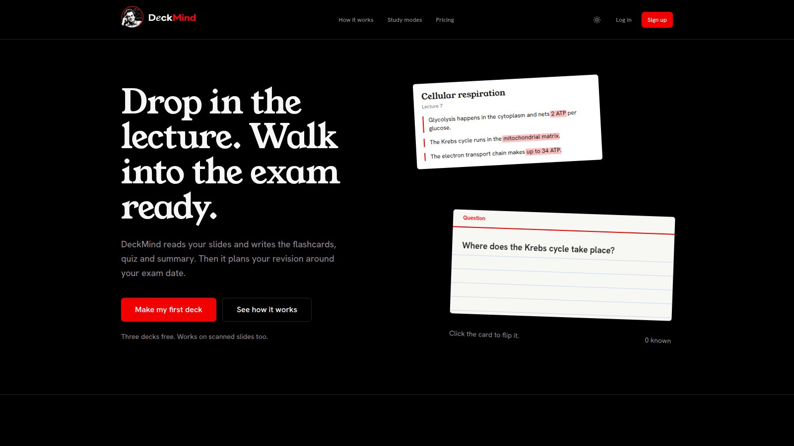
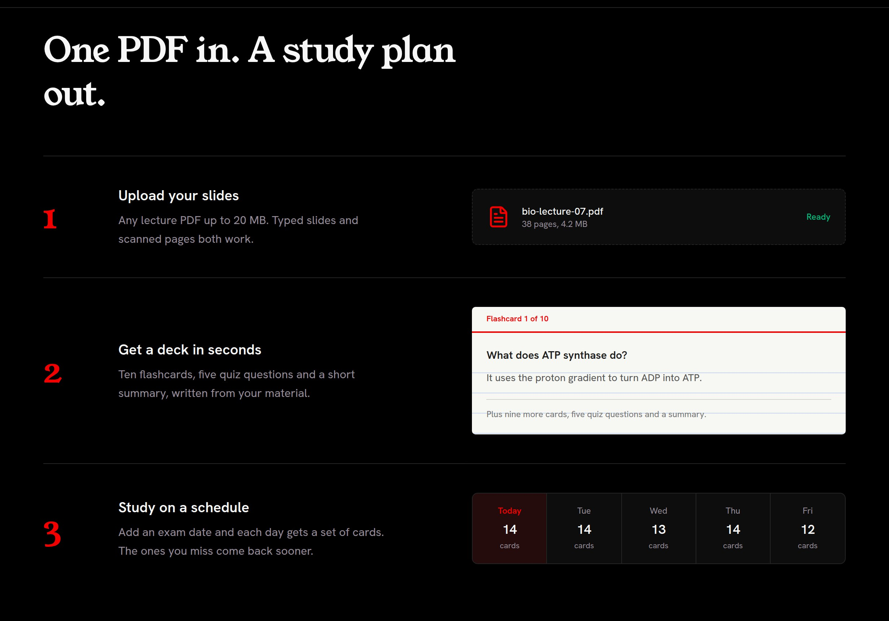
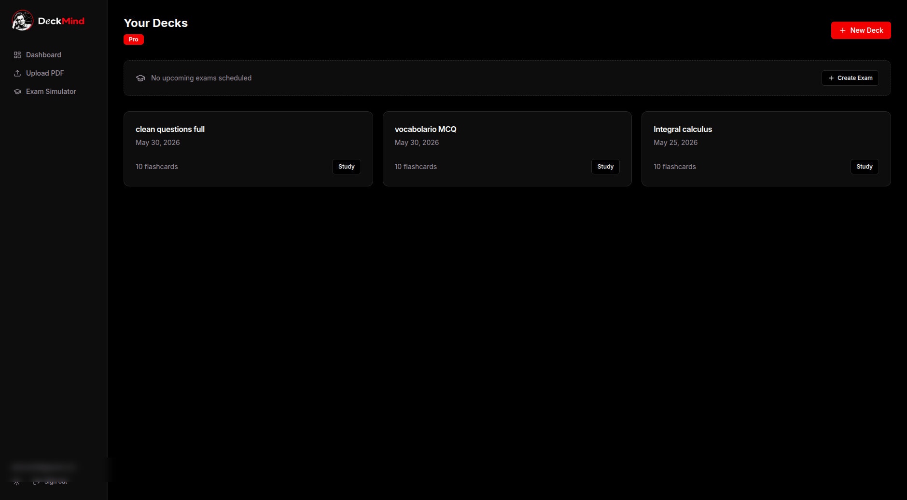
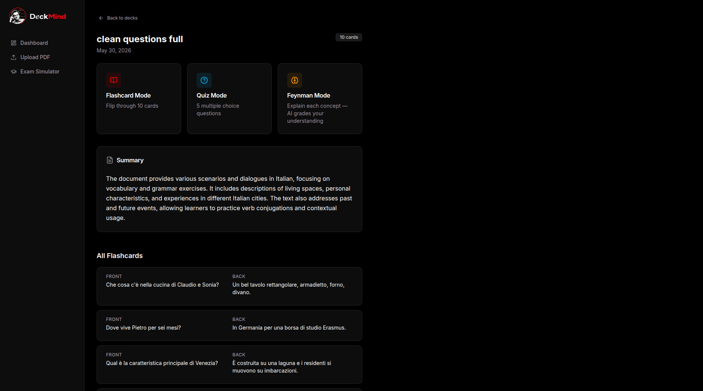
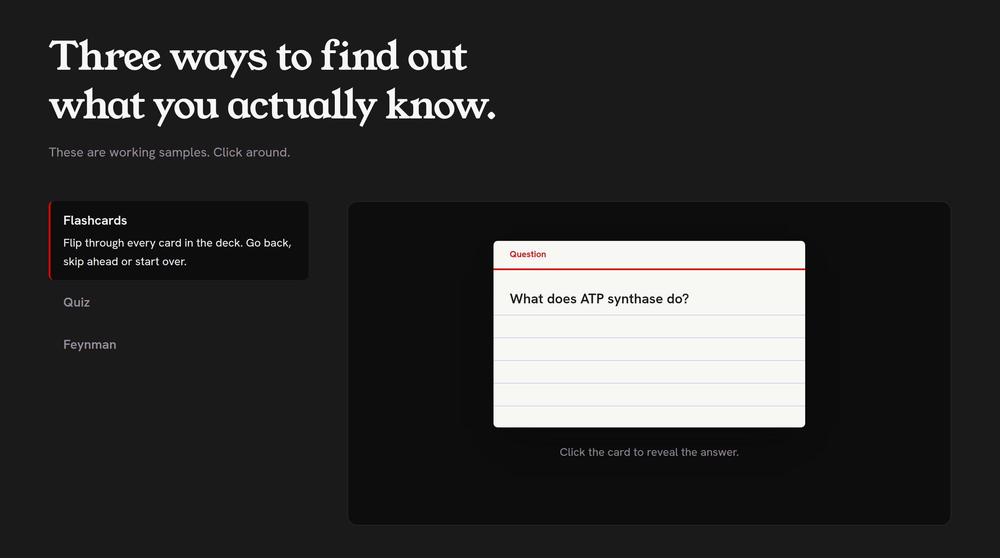
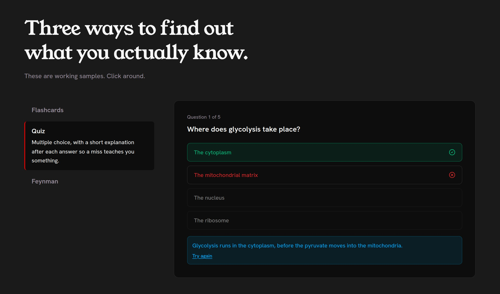
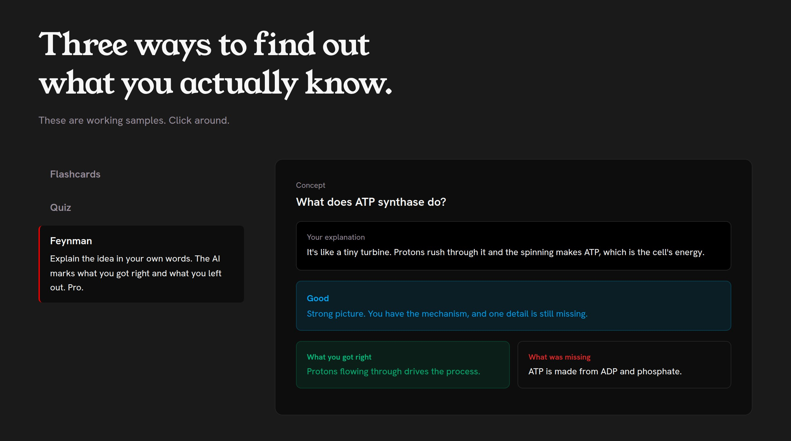
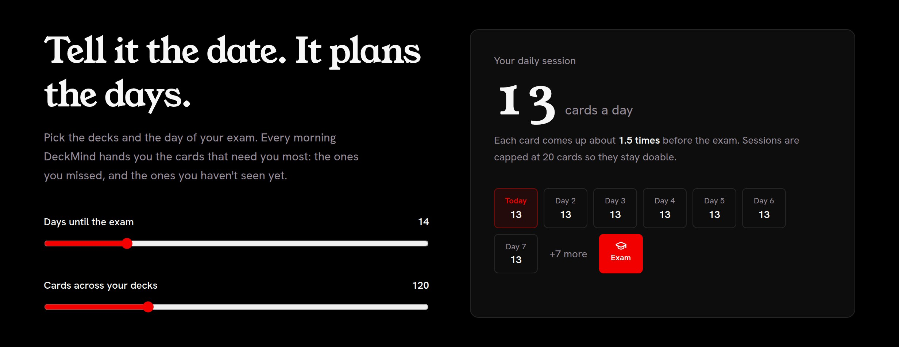
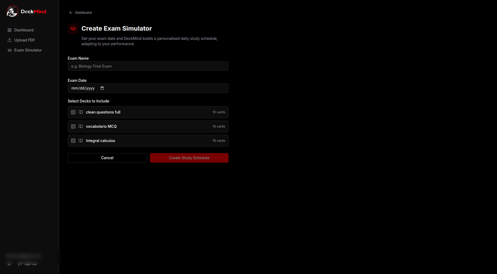
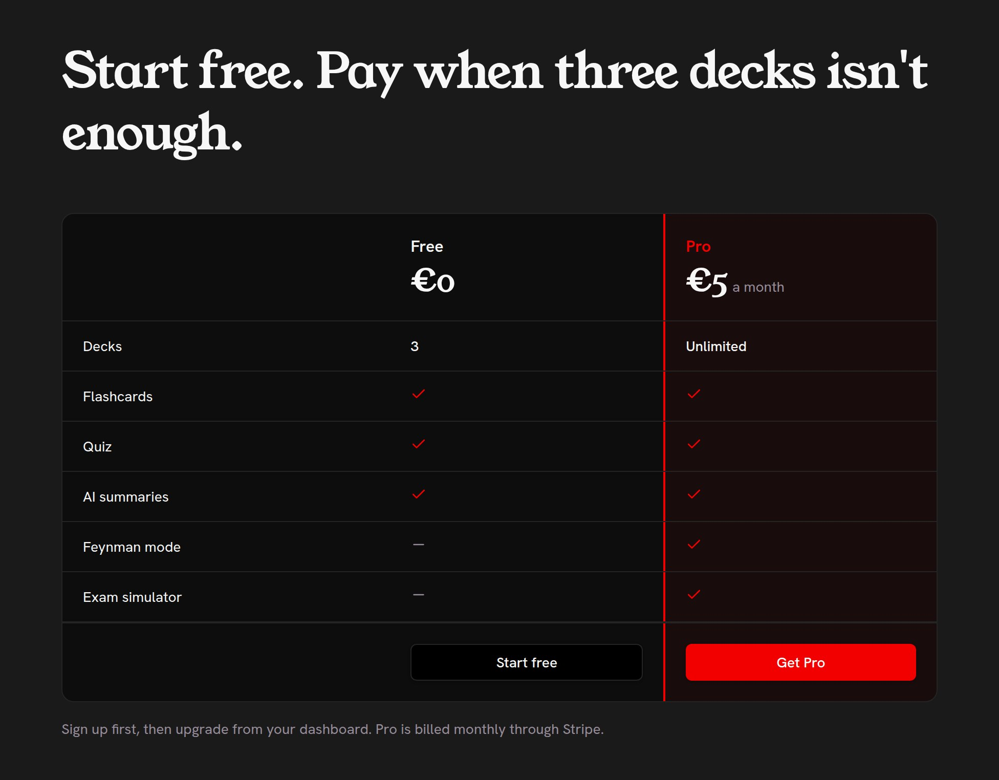

# DeckMind

**Drop in the lecture. Walk into the exam ready.**

DeckMind turns lecture slides into flashcards, quizzes and a personalised exam plan. Upload a PDF, typed or scanned, and it writes the study material, then plans your revision up to the exam date.

**[Try the live app →](https://deckmind-puce.vercel.app)**

> This is a showcase. The source code is private. Happy to walk through it in an interview.

---

## At a glance

| | |
| --- | --- |
| **2** | AI paths: typed text or scanned slides |
| **3** | ways to study one deck |
| **8** | database tables, all behind row-level security |
| **€5** | a month for Pro, through Stripe |

Built by a team of four at Studio Alpakin over about four months, in 2026.

---

## Features

1. **One PDF in, a deck out.** Ten flashcards, five quiz questions and a summary from any lecture PDF, typed or scanned.
2. **Your decks.** Every deck opens on its three study modes, the summary and every card.
3. **Flashcards.** 3D flip cards to step through, back and forth.
4. **Quiz.** Multiple choice with an explanation after every answer.
5. **Feynman mode.** Explain a concept in your own words; the AI grades what you got right and what you missed.
6. **An exam plan.** A daily session up to the exam, weighted toward the cards you keep missing.
7. **Free, then Pro.** Three decks free; €5 a month for unlimited decks, Feynman mode and the exam plan.

### One PDF in, a deck out

Drop in a lecture PDF up to 20 MB. Typed slides have their text pulled out and sent to GPT-4o-mini, which is fast and cheap. Scanned slides with no text layer go to GPT-4o as the PDF itself, so it reads the pages the way you would.

### Your decks

The dashboard lists your decks and upcoming exams. Each deck opens on its three study modes, the summary and every card front and back. Right-click any deck to jump straight into a mode, rename it or delete it; deleting a deck also takes it out of any exam that used it.

### Flashcards, quiz and Feynman mode

Every card flips in 3D on a spring. Quiz answers lock in right away, mark the correct option and explain it, so a wrong answer still teaches you something. In Feynman mode you write a concept out in your own words, and the AI grades it from *excellent* to *off track*, lists what you got right and what you missed, and sums up the idea in one plain sentence.

### An exam plan

Pick your decks and the exam date. Each morning there's a session of 5 to 20 cards, enough to see every card about one and a half times before the day. Cards you keep missing, haven't seen yet or haven't seen in a while come up first.

### Free, then Pro

Three decks free, with flashcards, quizzes and summaries. Pro removes the deck limit and adds Feynman mode and the exam plan, billed through Stripe Checkout. A signed webhook switches Pro on when you pay and off when you cancel.

---

## Stack

| Layer | Technology | What it does here |
| --- | --- | --- |
| Framework | Next.js 16 | App Router, server components and server actions; `proxy.ts` guards the app routes |
| Language | TypeScript | End to end, with Vitest unit tests for the parsing and routing logic |
| Data & auth | Supabase | Postgres with row-level security on every table, email and Google sign-in over cookies, a trigger for the free-tier limit |
| AI | OpenAI | GPT-4o-mini writes decks from typed text and grades Feynman explanations; GPT-4o reads scanned PDFs |
| PDF | pdf-parse | Pulls the text layer out of a PDF, so most decks never need the bigger model |
| Payments | Stripe | Checkout for the Pro subscription, a signed webhook to switch it on and off |
| Interface | Tailwind CSS 4 · Radix UI | Design tokens in CSS, accessible dialogs and right-click menus |
| Motion | Framer Motion | Spring card flips, page transitions and a custom cursor with a trailing ring |
| Hosting | Vercel | Serverless routes with a two-minute budget for the AI calls |

---

## Under the hood

**The AI's answer is checked, not trusted.** JSON mode guarantees valid JSON, not the right fields. Every card and question is checked before it's saved: blank ones and out-of-range answers are dropped, and a deck with no usable cards fails outright instead of saving empty cards that would stay broken forever.

**The free limit holds up in a race.** The deck count is checked before the AI call, and the save only comes after a slow AI call, so two uploads at once could both pass. A Postgres trigger repeats the count at insert time and locks the user's row, so the third free deck really is the last.

**Scheduling by priority.** Each card gets a priority: 60% from how badly it's going, 25% from how long since you last saw it, and a 15% bonus if you haven't seen it yet. "Got it" adds 0.25 to the card's score and "Still learning" takes 0.15 off, so tomorrow's session follows what actually happened today.

**Finishing twice changes nothing.** A retry or a double click can send "session complete" twice. The second one is ignored, and results for cards that weren't in the session are thrown away, so scores can't be counted twice or written for cards that weren't studied.

**Every row has an owner.** Row-level security limits every table to its owner, and the rename and delete actions check ownership again themselves, because anyone can call a server action directly, not only through the UI.

**Uploads don't pile up.** Scanned PDFs are uploaded to OpenAI only for the time it takes to read them, then deleted, even if generation fails. If saving the cards fails halfway through, the half-made deck is removed, so it doesn't use up one of the three free slots.

---

© 2026 Studio Alpakin. All rights reserved. The screenshots and this write-up may not be reused without permission.
